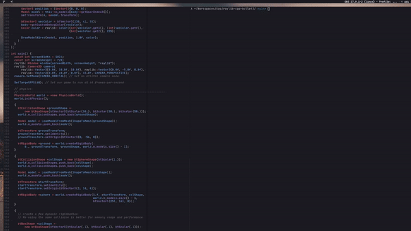

# raylib-cpp-bullet3
C, Cpp, Cmake, Raylib, Raylib-cpp and Bullet3 Boilerplate 



## Usage

```bash
make setup
make build
./build/src/main
```

## Features
This is a Cpp project template with the following features:

 - CMake build scripts for building libraries, applications, and tests.
 - Integrated with [Raylib](https://www.raylib.com/).
 - Integrated with [Bullet3](https://bulletphysics.org).
 - Resource folder to include assets

## License
This is free and unencumbered software released into the public domain.  
For more information, please refer to <http://unlicense.org/>
